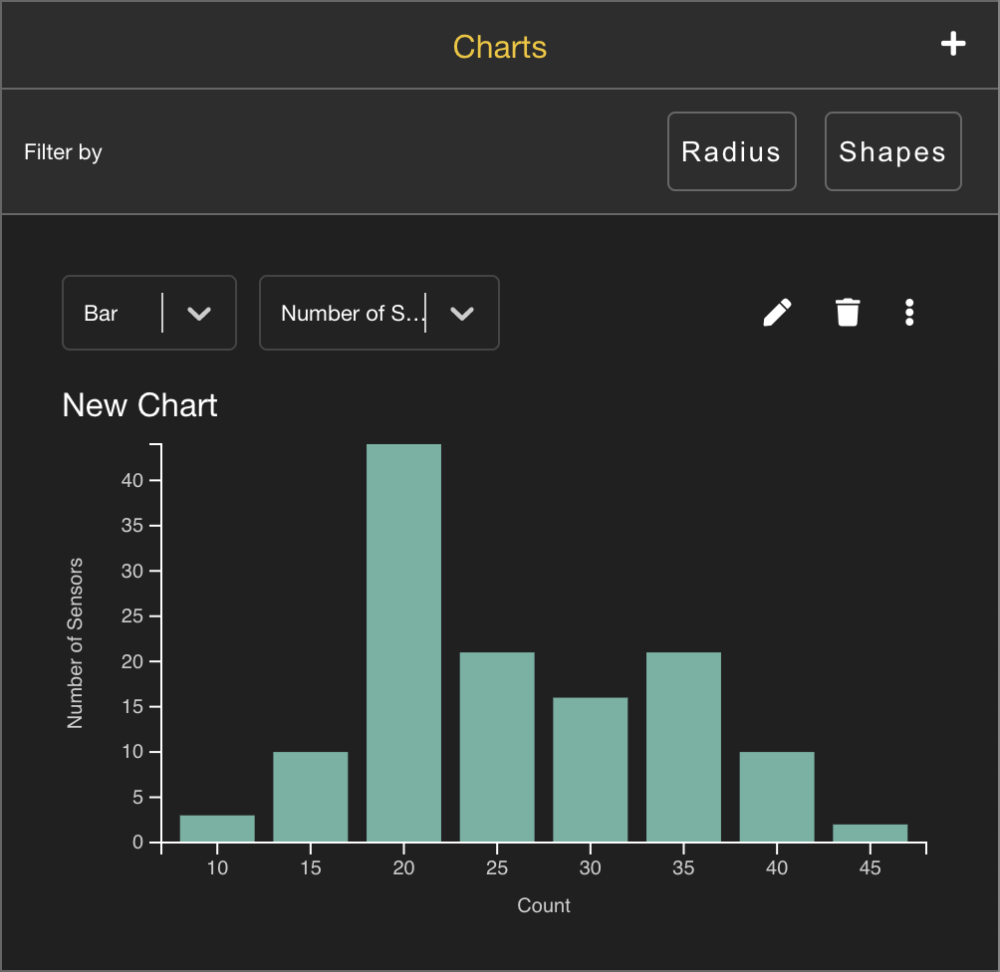
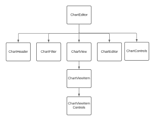
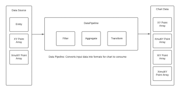

# ChartWidget
Chart data visualization component (prototype) for geospatial data feeds. Orginally designed for liveearth as a replacement for charts app.

&nbsp;

  

&nbsp;

Design Rework Presentation: [here](https://docs.google.com/presentation/d/1XuBSfyKTM-RdB8HzKc5j1Ga_krAomEZZXqDqXoEVPqo/edit?usp=sharing)

Demo of Charts Widget Prototype in Liveearth app: [here](https://drive.google.com/file/d/19Vsk0IXWofrrRB2lrHm07c0SLMpBVQHm/view?usp=share_link) 

## Overview
Chart entity event data feeds with Number, Bar, Pie, Line, Time Series

## Chart Features

- Can plot Entity Event data for a Feed / Layer
- Can resize ChartWidget by dragging edge of Widget
- Chart Types Supported: Number, Bar, Pie, Line, Time Series
- TimeSeries charts can plot two separate sets of data
- Charts are rearrangeable by drag and drop
- Plots have tooltips 
- Can look at data in a Table View
- Can Create, Edit, Remove, Delete Chart
- Edit: Can edit chart name, feed/layer, aggregation method, attribute to group by (attribute to plot)
- Edit (TimeSeries): Can edit chart name, feed/layer, aggregation method, y axis (attribute to plot), Chart Type (Bar or Line), Metric Calculation, History, and Secondary Options (Y Axis, Chart Type, Metric Calculation)
- Create: Can create a new chart with the same options available in Edit Chart
- Create: Can use an existing chart 
- Chart has message if there is no data 
- Data Aggregation: Can group by Count, Sum, Mean, Median, Std Dev

## Widget Architecture
### File Structure 
- components: react components 
- libraries:  utility functions that don’t have side effects. (exposed api)
- services:  functions that touch endpoints & communicate with APIs (contains interfaces with default impelmentations for services)
- reducers:  functions that modify state & have side-effects.
- models:  types & classes, if the classes interact with an API, they should make a call to things in services/
- state: the classes & Higher order components necessary to create the context for reducers to use. Should be pretty lightweight. 
- styles: scss styles

### Component Architecture

  

### Data Pipeline 

  

# Getting Started 

To run app locally:

- Install nodejs
- Install third party packages: `npm run build`
- To run frontend server: `npm start`
- Open [http://localhost:3000](http://localhost:3000) to view it in the browser.
